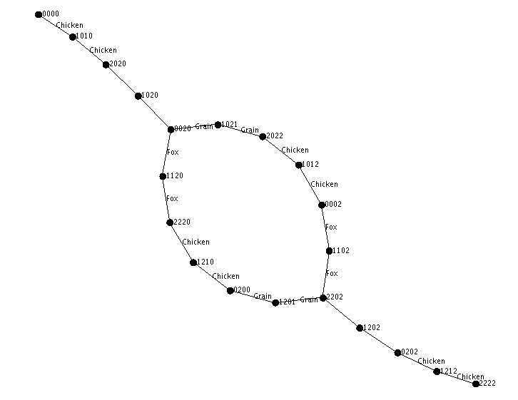

# FarmerFoxChickenGrain

This project uses basic artificial intelligence concepts to solve the following riddle:

<p>A man has to get a fox, a chicken, and a sack of grain across a river. 
He has a rowboat, and it can only carry him and one other thing.
If the fox and the chicken are left together, the fox will eat the chicken.
If the chicken and the grain are left together, the chicken will eat the grain.</p>

<b>Get the farmer, fox, chicken and grain across the river.</b>
------------------

This is the decision tree generated from the rules of the riddle.

  

<b>Location states</b>
```
            !                !
            !                !
            !                !
            !                !
LEFT SIDE   !    RIVER       !    RIGHT SIDE
            !                !
            !                !
            !                !
            !                !
    0               1               2
```
    
<b>State syntax</b>

Each node on the graph has a four digit number. The each digit represents where the riddle participants are located. 

<i>Start State</i> - Everyone is on the left side.
```
0 Farmer
0 Fox
0 Chicken
0 Grain
```

<i>End State</i> - Everyone is on the right side.
```
2 Farmer
2 Fox
2 Chicken
2 Grain
```

<i>Random State</i> - The farmer and the fox are in the boat, the chicken is on the left, and the grain is on the right.
```
1 Farmer
1 Fox
0 Chicken
2 Grain
```
-----------------------

The project was created with IntelliJ and uses GraphStream libraries that are already included.

After running the app, you should see a visual representation of the graph used to solve this problem, along with a output of the solution. 


```  
Number of possible states: 81
Number of valid states: 20
Solution: [0000, 1010, 2020, 1020, 0020, 1021, 2022, 1012, 0002, 1102, 2202, 1202, 0202, 1212, 2222]
            |            |            
  Farmer    |            |            
  Fox       |            |            
  Chicken   |            |            
  Grain     |            |            
            |            |            
--------------------------------------
            |            |            
            |    Farmer  |            
  Fox       |            |            
            |   Chicken  |            
  Grain     |            |            
            |            |            
--------------------------------------
            |            |            
            |            |    Farmer  
  Fox       |            |            
            |            |   Chicken  
  Grain     |            |            
            |            |            
--------------------------------------
            |            |            
            |    Farmer  |            
  Fox       |            |            
            |            |   Chicken  
  Grain     |            |            
            |            |            
--------------------------------------
            |            |            
  Farmer    |            |            
  Fox       |            |            
            |            |   Chicken  
  Grain     |            |            
            |            |            
--------------------------------------
            |            |            
            |    Farmer  |            
  Fox       |            |            
            |            |   Chicken  
            |     Grain  |            
            |            |            
--------------------------------------
            |            |            
            |            |    Farmer  
  Fox       |            |            
            |            |   Chicken  
            |            |     Grain  
            |            |            
--------------------------------------
            |            |            
            |    Farmer  |            
  Fox       |            |            
            |   Chicken  |            
            |            |     Grain  
            |            |            
--------------------------------------
            |            |            
  Farmer    |            |            
  Fox       |            |            
  Chicken   |            |            
            |            |     Grain  
            |            |            
--------------------------------------
            |            |            
            |    Farmer  |            
            |       Fox  |            
  Chicken   |            |            
            |            |     Grain  
            |            |            
--------------------------------------
            |            |            
            |            |    Farmer  
            |            |       Fox  
  Chicken   |            |            
            |            |     Grain  
            |            |            
--------------------------------------
            |            |            
            |    Farmer  |            
            |            |       Fox  
  Chicken   |            |            
            |            |     Grain  
            |            |            
--------------------------------------
            |            |            
  Farmer    |            |            
            |            |       Fox  
  Chicken   |            |            
            |            |     Grain  
            |            |            
--------------------------------------
            |            |            
            |    Farmer  |            
            |            |       Fox  
            |   Chicken  |            
            |            |     Grain  
            |            |            
--------------------------------------
            |            |            
            |            |    Farmer  
            |            |       Fox  
            |            |   Chicken  
            |            |     Grain  
            |            |            
--------------------------------------  
```

  
